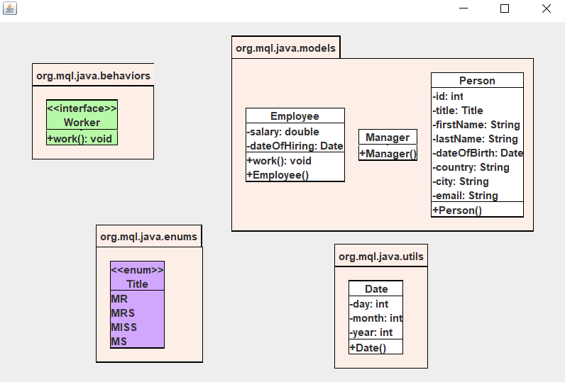
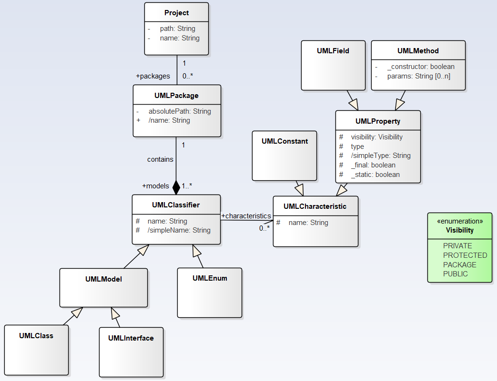
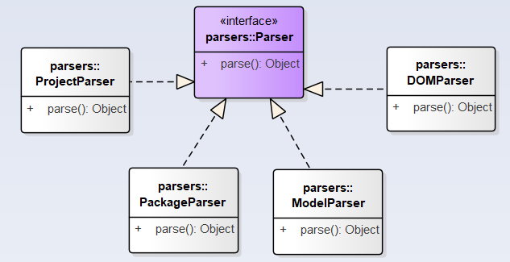

# UML Diagram generator

Une application permettant d’extraire l’ensemble des classes et packages d’un projet Java. L’objectif final étant de construire comme sortie :

- Un diagramme de packages et donc l’architecture globale du projet
- Les diagrammes de classes UML correspondants.

# L'utilisation :
Passez deux parametres lors l'execution :
- le chemin vers le dossier contenant les fichiers binaires (.class) et les autres packages.
- le chemin ou vous voulez enregistrer le fichier xml contenant la hierarchie du projet en question.

Un exemple basique du resultat de l'execution :

Le diagramme de classe des modeles de donnees UML du projet :

Le diagramme des parseurs :
