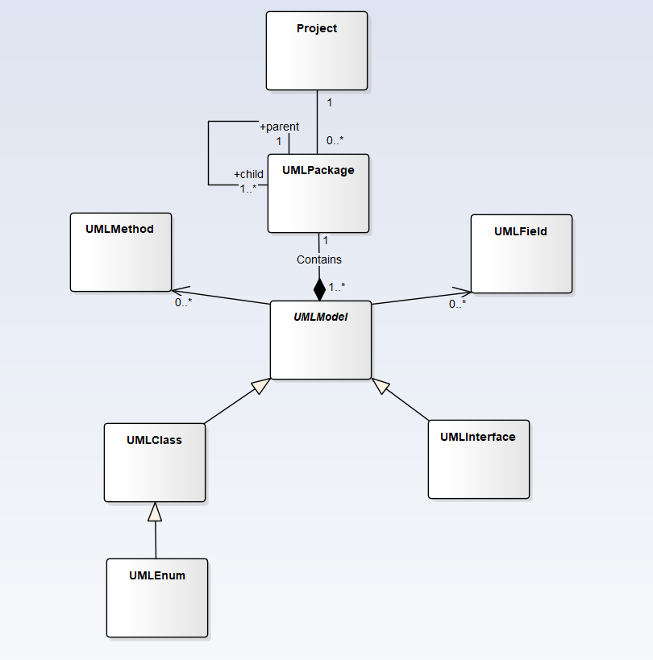

# UML Diagram generator

Une application permettant d’extraire l’ensemble des classes et packages d’un projet Java. L’objectif final étant de construire comme sortie :

- Un diagramme de packages et donc l’architecture globale du projet
- Les diagrammes de classes UML correspondants.

Le diagramme de classe du projet :

